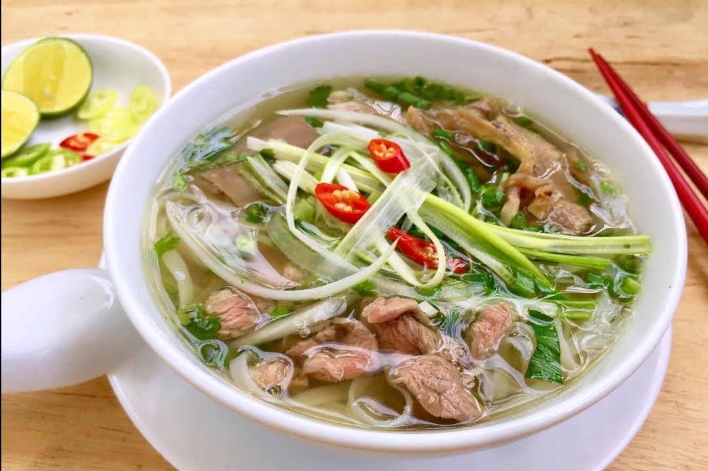
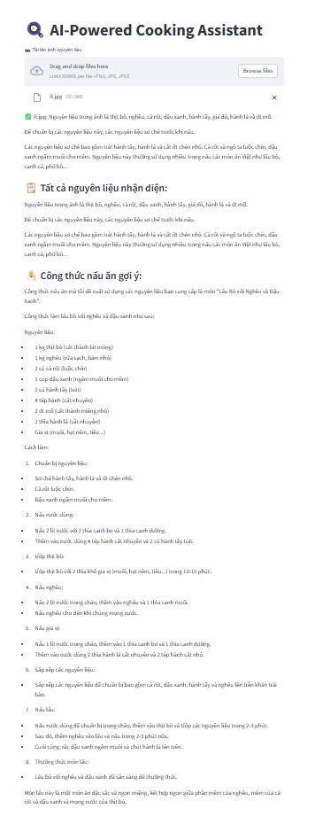

# AI-Powered Cooking Assistant

## Overview
An AI-powered cooking assistant that uses **LLaMA 3.2 Vision** via **Groq Cloud** to analyze images of ingredients and suggest recipes. The app is built with **Streamlit** for an interactive user interface.

## Features
- Upload ingredient images
- AI analyzes images to identify ingredients
- Suggests recipes based on identified ingredients

## Installation
### 3. Set Up API Key
Find a `.env` file in the project directory and add your key:
```ini
GROQ_API_KEY=your_api_key_here
```

## Usage
Run the Streamlit app:
```bash
streamlit run main.py
```


## Output Example

### Ingredient Identification


### Recipe Suggestion



